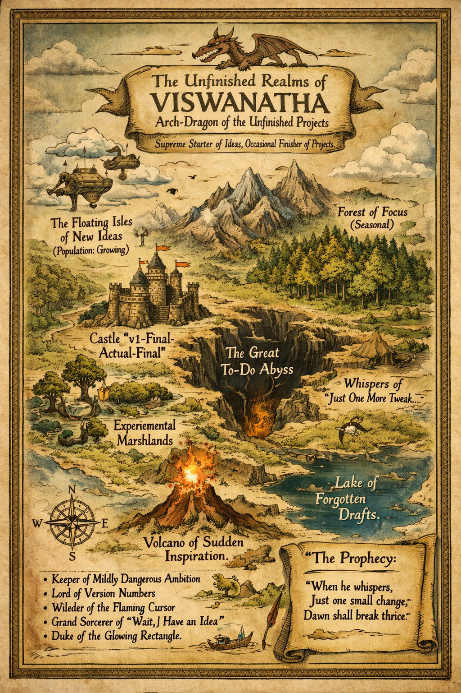

# 🐉 VISWANATHA,  
## Arch-Dragon of the Unfinished Realms  
### Supreme Starter of Projects  
#### Occasional Finisher*

\*Finishing may occur during rare cosmic alignments and optimal snack conditions.

---

## 📖 A Brief & Entirely Accurate History

In the Age of Perpetual Tabs¹ there arose a Dragon of Considerable Curiosity.

He did not conquer lands.

He conquered **ideas**.

And occasionally reorganized them at 2:17 AM.

---

### ¹ The Age of Perpetual Tabs  
*A turbulent era in which no fewer than 47 browser tabs were open “for later.” None were revisited.*

---

## 🗺️ THE KINGDOM MAP (Cartographically Dubious)

Adventurers who enter the Great To-Do Abyss report hearing whispers of  
“just one more tweak.”

---

## ⚔️ Titles Bestowed (Mostly by Himself)

- 🐲 Keeper of Mildly Dangerous Ambition  
- 📜 Lord of Version Numbers  
- 🔥 Wielder of the Flaming Cursor  
- 🧙‍♂️ Grand Sorcerer of “Wait, I Have an Idea”  
- 🎮 Duke of the Glowing Rectangle  

All titles remain uncontested.

---

## 📜 The Prophecy (Annotated for Safety)

> “When the Dragon declares,  
> ‘This shall be simple,’  
> The universe shall laugh.”²  

> “When he whispers,  
> ‘Just one small change,’  
> Dawn shall break thrice.”

---

### ² The Universe  
Has an excellent sense of timing and poor boundaries.

---

## 🌙 The Nature of the Dragon

He breathes not fire — but:

- ✨ Sudden inspiration  
- ⚡ Hyperfocus  
- ☕ Caffeine vapor  
- 📜 Structured chaos  

He wanders.  
He experiments.  
He refines.

And occasionally… ships.

---

# 🌐 Summoning Rituals (Social Scrolls)

Should you wish to contact the Dragon, attempt one of the following portals:

- 📷 Instagram → https://instagram.com/kartha.vis  
- 💼 LinkedIn → https://linkedin.com/in/viswanathakarthav  
- ✍️ Medium → https://medium.com/@vichukartha  
- 🐦 X → https://x.com/ViswanathKartha  
- 🎥 YouTube → https://youtube.com/@anima-regem  
- 🌌 Mastodon → https://mastodon.social/@animaregem  

Responses may vary depending on quest status.

---

# 📊 Royal Telemetry (Arcane Metrics)

---

## 🗡️ Final Inscription

If you encounter Viswanatha in the wild,  
do not ask:

“Is this the final version?”

There is no final version.

There is only evolution.

And possibly a sequel.

---

*Thus concludes this official scroll of mild chaos.* 🐉✨
